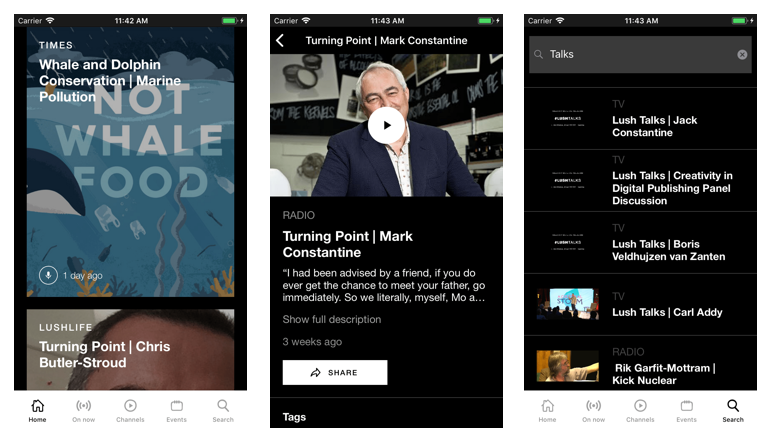
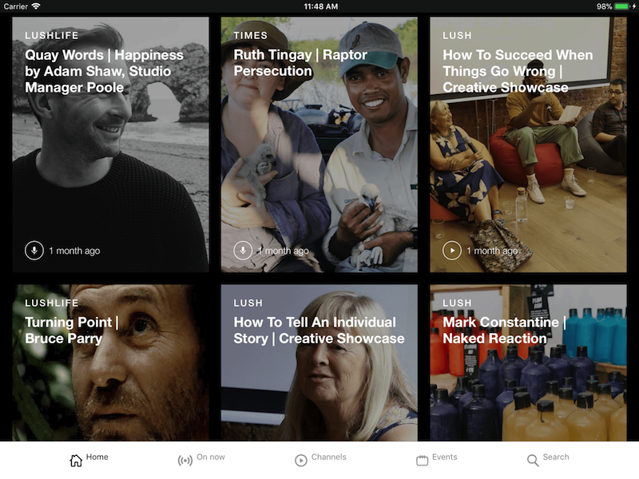
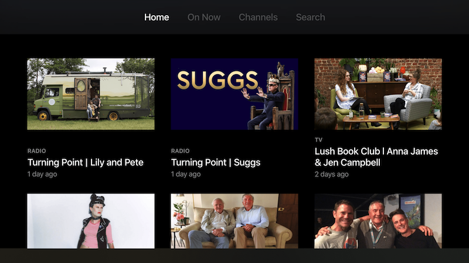
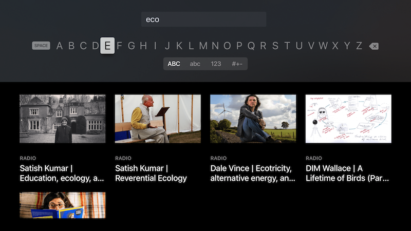

# Lush Player App

[](https://www.bitrise.io/app/04b636f38865a7ab)

The tvOS and iOS client for Lush's Player app. Lush Player provides a wide range of audio and video content.


## Screenshots  







## Running

Please make sure you have checked out and pulled all submodules before running

1. Make sure that you have the correct Brightcove 'policy ids' in the app's respective platform's Info.plist: 

	```
		<key>BrightcoveLivePolicyID</key>
		<string>live_policy_id_here</string>
		<key>BrightcoveOnDemandPolicyID</key>
		<string>on_demand_policy_id_here</string>
	```      
	
	For the tVOS app the plist will be located at:  
	   `Lush Player/Info.plist`   
	   For iOS the plist will be located at:  
	   `Lush Player iOS/Info.plist `
		     
2. Run the app using Xcode, you can choose to either run the iOS version of tvOS version by changing the scheme in the top left part of Xcode editor.

## Project guidelines

### Project structure
The Xcode project includes both tvOS and iOS apps, they are separated under specific Schemes. Shared code is provided through a LushPlayerKit framework, which both apps import. The iOS client supports iPhone and iPad, in all orientations.
 
For the tvOS app the structure follows:

- `Lush Player/` - The root group for all app logic and assets
    - `AppDelegate.swift` - The single point of entry for the App
    - `Helpers/` - Helper classes for performing common and complicated tasks in the codebase
    - `Models/` - Model classes for all LUSH API objects
    - `Controllers/` - Controllers for all API calls, and any other logic which requires controller logic
    - `Views/` - Any re-usable `UIView` subclasses used in the codebase
    - `View Controllers/` - All view controllers used in the codebase
    - `Main.storyboard` - The storyboard for the app's UI
    - `Assets.xcassets` - All image assets for the app
    - `Info.plist` - The app's info.plist file

- `Lush Player iOS/` - The root group for the iOS specific files
    - `AppDelegate.swift` - The single point of entry for the App
    - Files are organised by screens/features rather than by MVC, i.e `Home/`, `Search/`

### Documenting code

Please make sure to document all public functions, variables and classes fully and comment code where it is necessary. We are using the standard swift Markdown [documentation style](http://nshipster.com/swift-documentation/) for documenting the code, which can be partially auto-generated using the keyboard shortcut `cmd+\` when the cursor is on a function name or variable name.